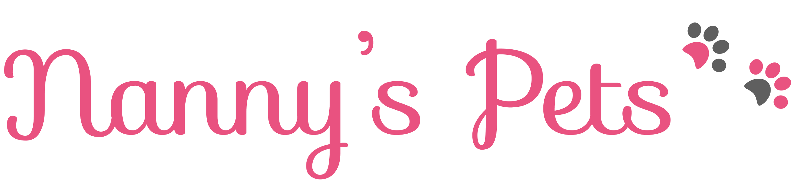

# Nanny's Pets

O projeto Nanny's Pets tem como objetivo desenvolver um sistema para o serviço de hospedagem de cachorros e gatos pela necessidade de eventual compromisso dos seus donos, deixando assim seu(s) pet(s) nas casas de hospedeiros que sejam capacitados para realizar o serviço.  

 

# Equipe e Formas de Contato

Versão 2.1
1. Anna Carolinne - [GitHub](https://github.com/anna-albuquerque)
 

Versão 2.0 
1. Anna Carolinne - [GitHub](https://github.com/anna-albuquerque) 
2. Joana Fernandes - [Github](https://github.com/JoanaFernandes1998)
3. Renato Bernardino - [GitHub](https://github.com/renatobernardinodasilva)
4. Virgínia Cláudia - [GitHub](https://github.com/VCLM)
5. Wemerson Chagas - [Github](https://github.com/wemersonchaga)
**Orientador:** Plácido Neto - [GitHub](https://github.com/placidoneto)
 

# Ferramentas e tecnologias utilizadas no desenvolvimento do projeto:

* Github para a realizar o controle de versões do projeto.
* Figma para a prototipação em baixa, média e alta fidelidade da interface do sistema;
* ERDPlus para elaboração dos diagramas ER;
* Html 5 como linguagem de marcação;
* CSS 3 para estilizar as páginas web;
* Python + Django Framework Web da linguagem de programação Python;   
 

# Documentação

* [Documento de visão](Docs/DocumentoDeVisao/doc-visao.md)
* [Diagrama Entidade-Relacionamento](Docs/DiagramaER/DiagramaER.md)
* [Diagrama de Classe de Domínio](Docs/DiagramaDeClassesDeDominio/dominio.md)
* [Diagrama de Contexto](Docs/DiagramaDeContexto/Diagrama-Contexto.md)
* [Diagrama de Container](Docs/DiagramaDeContainer/DiagramaDeContainer.md)
* [Modelo de casos de uso](Docs/CDUs/cdu.md)
* [Visão Arquitetural](Docs/VisaoArquitetural/VisaoArquitetural.md)
* [Diagrama de Sequência](Docs/DiagramaDeSequencia/DiadramaDeSequencia.md)
* [Diagrama de Interação](Docs/DiagramaDeInteracao/DiagramaDeInteracao.md)
* [Dicionário de Dados](Docs/DicionarioDeDados/DicionarioDeDados.md)
* [Protótipos de interface com o usuário](Docs/prototipos/prototipos.md)
* [Guia do desenvolvedor](Docs/guia-receber-pets.md)
